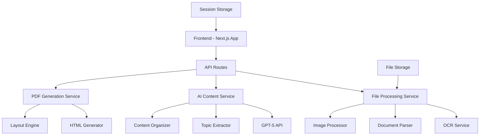

# Design Document

## Overview

The cheat sheet generator is a Next.js web application that transforms multiple file formats into customized study materials using AI-powered content extraction and organization. The system leverages GPT-5 for intelligent content processing while maintaining strict fidelity to source materials and providing users with granular control over the final output.

The application follows a multi-stage workflow: file upload → content extraction → topic organization → user selection → customization → generation. Each stage provides user feedback and allows for iterative refinement.

## Architecture

### System Architecture



### Technology Stack

**Frontend:**
- Next.js 15 with React 19
- TypeScript for type safety
- Tailwind CSS for styling
- Radix UI components for consistent UX
- React Hook Form for form management

**Backend:**
- Next.js API Routes for serverless functions
- GPT-5 integration for AI processing
- File processing libraries (pdf-parse, mammoth, etc.)
- OCR service integration (Tesseract.js or cloud OCR)

**File Processing:**
- `pdf-parse` for PDF text extraction
- `mammoth` for Word document processing
- `xlsx` for Excel file handling
- `node-html-parser` for PowerPoint XML parsing
- `sharp` for image processing and optimization

**AI Integration:**
- OpenAI GPT-5 API for content analysis and organization
- Custom prompts for topic extraction and content preservation
- Agent-to-agent communication protocol for content validation

## Components and Interfaces

### Core Components

#### 1. File Upload System
```typescript
interface FileUploadProps {
  acceptedTypes: string[]
  maxFileSize: number
  onFilesSelected: (files: File[]) => void
  onError: (error: string) => void
}

interface UploadedFile {
  id: string
  file: File
  status: 'pending' | 'processing' | 'completed' | 'error'
  extractedContent?: ExtractedContent
}
```

#### 2. Content Extraction Engine
```typescript
interface ExtractedContent {
  text: string
  images: ExtractedImage[]
  tables: ExtractedTable[]
  metadata: FileMetadata
  structure: DocumentStructure
}

interface ExtractedImage {
  id: string
  base64: string
  ocrText?: string
  context: string
  isExample: boolean
}

interface DocumentStructure {
  headings: Heading[]
  sections: Section[]
  hierarchy: number
}
```

#### 3. AI Topic Organization
```typescript
interface TopicExtractionRequest {
  content: ExtractedContent[]
  userPreferences: {
    maxTopics: number
    focusAreas: string[]
    excludePatterns: string[]
  }
}

interface OrganizedTopic {
  id: string
  title: string
  content: string
  subtopics: SubTopic[]
  sourceFiles: string[]
  confidence: number
  examples: ExtractedImage[]
  originalWording: string
}
```

#### 4. User Selection Interface
```typescript
interface TopicSelectionProps {
  topics: OrganizedTopic[]
  onTopicToggle: (topicId: string, selected: boolean) => void
  onContentEdit: (topicId: string, newContent: string) => void
  onPreview: (selectedTopics: string[]) => void
}
```

#### 5. Layout Customization
```typescript
interface CheatSheetConfig {
  paperSize: 'a4' | 'letter' | 'legal' | 'a3'
  orientation: 'portrait' | 'landscape'
  columns: 1 | 2 | 3
  fontSize: 'small' | 'medium' | 'large'
  pageCount: number
  referenceTemplate?: File
  customStyles?: CSSProperties
}
```

#### 6. PDF Generation Engine
```typescript
interface GenerationRequest {
  topics: SelectedTopic[]
  config: CheatSheetConfig
  referenceText?: string
  referenceImages?: File[]
}

interface GenerationResult {
  html: string
  pdf?: Buffer
  warnings: ContentWarning[]
  pageCount: number
  contentFit: ContentFitAnalysis
}
```

### Service Interfaces

#### File Processing Service
```typescript
interface FileProcessor {
  processFile(file: File): Promise<ExtractedContent>
  extractText(file: File): Promise<string>
  extractImages(file: File): Promise<ExtractedImage[]>
  performOCR(image: Buffer): Promise<string>
}
```

#### AI Content Service
```typescript
interface AIContentService {
  extractTopics(content: ExtractedContent[]): Promise<OrganizedTopic[]>
  organizeContent(topics: RawTopic[]): Promise<OrganizedTopic[]>
  recreateExamples(examples: ExtractedImage[]): Promise<GeneratedImage[]>
  validateContentFidelity(original: string, processed: string): Promise<FidelityScore>
}
```

## Data Models

### File Processing Models
```typescript
interface FileMetadata {
  name: string
  size: number
  type: string
  lastModified: Date
  pageCount?: number
  wordCount?: number
}

interface ProcessingResult {
  fileId: string
  status: ProcessingStatus
  content: ExtractedContent
  errors: ProcessingError[]
  processingTime: number
}
```

### Content Organization Models
```typescript
interface RawTopic {
  text: string
  context: string
  sourceLocation: SourceLocation
  confidence: number
}

interface SourceLocation {
  fileId: string
  page?: number
  section?: string
  coordinates?: BoundingBox
}

interface ContentHierarchy {
  mainTopics: OrganizedTopic[]
  relationships: TopicRelationship[]
  duplicates: DuplicateGroup[]
}
```

### Generation Models
```typescript
interface LayoutCalculation {
  availableSpace: Dimensions
  contentRequirements: ContentRequirements
  overflow: OverflowAnalysis
  recommendations: LayoutRecommendation[]
}

interface ContentWarning {
  type: 'overflow' | 'quality' | 'missing'
  severity: 'low' | 'medium' | 'high'
  message: string
  affectedContent: string[]
  suggestions: string[]
}
```

## Error Handling

### File Processing Errors
- **Unsupported Format**: Clear error messages with supported format list
- **File Size Limits**: Progressive upload with size warnings
- **Corrupted Files**: Graceful degradation with partial content extraction
- **OCR Failures**: Fallback to manual text input options

### AI Processing Errors
- **API Rate Limits**: Queuing system with user feedback
- **Content Analysis Failures**: Fallback to rule-based topic extraction
- **Fidelity Validation Errors**: User warnings with manual review options

### Generation Errors
- **Content Overflow**: Interactive warnings with reduction suggestions
- **Layout Issues**: Automatic layout adjustments with user approval
- **PDF Generation Failures**: HTML fallback with print optimization

### Error Recovery Strategies
```typescript
interface ErrorRecovery {
  retryWithBackoff(operation: () => Promise<any>, maxRetries: number): Promise<any>
  fallbackToManual(automaticResult: any, userInput: UserInput): any
  gracefulDegradation(fullFeature: any, limitedFeature: any): any
}
```

## Testing Strategy

### Unit Testing
- **File Processors**: Test each file type with sample documents
- **AI Integration**: Mock GPT-5 responses for consistent testing
- **Layout Engine**: Test various content sizes and configurations
- **Content Validation**: Test fidelity preservation algorithms

### Integration Testing
- **End-to-End Workflows**: Complete user journeys from upload to generation
- **API Route Testing**: All endpoints with various input scenarios
- **File Processing Pipeline**: Multi-format processing chains
- **Error Handling**: Failure scenarios and recovery mechanisms

### Performance Testing
- **Large File Processing**: Documents up to size limits
- **Concurrent Users**: Multiple simultaneous processing requests
- **Memory Usage**: File processing and content storage optimization
- **AI API Response Times**: Timeout handling and user feedback

### User Acceptance Testing
- **Content Fidelity**: Verify original content preservation
- **Layout Quality**: Visual assessment of generated cheat sheets
- **Usability**: User workflow efficiency and error recovery
- **Cross-Platform**: Browser compatibility and print quality

### Test Data Strategy
```typescript
interface TestDataSet {
  sampleFiles: {
    pdf: File[]
    word: File[]
    powerpoint: File[]
    images: File[]
    excel: File[]
  }
  expectedOutputs: {
    topics: OrganizedTopic[]
    layouts: GeneratedLayout[]
    warnings: ContentWarning[]
  }
  edgeCases: {
    corruptedFiles: File[]
    oversizedContent: File[]
    multiLanguage: File[]
  }
}
```

## Security Considerations

### File Upload Security
- File type validation beyond MIME types
- Virus scanning integration
- Size limits and rate limiting
- Temporary file cleanup

### AI Integration Security
- API key management and rotation
- Content sanitization before AI processing
- Response validation and filtering
- Usage monitoring and alerting

### Data Privacy
- No persistent storage of user content
- Session-based temporary storage only
- GDPR compliance for EU users
- Clear data retention policies

## Performance Optimization

### File Processing
- Streaming for large files
- Parallel processing for multiple files
- Caching of processed content
- Progressive loading indicators

### AI Integration
- Request batching for efficiency
- Response caching for similar content
- Fallback to cached results on failures
- Usage optimization to minimize costs

### Frontend Performance
- Lazy loading of components
- Virtual scrolling for large topic lists
- Optimized image rendering
- Progressive enhancement

## Deployment Architecture

### Development Environment
- Local Next.js development server
- Mock AI services for testing
- Local file processing
- Hot reloading for rapid iteration

### Production Environment
- Vercel deployment for Next.js app
- Serverless functions for API routes
- CDN for static assets
- Environment-based configuration

### Monitoring and Observability
- Error tracking with Sentry
- Performance monitoring
- AI API usage tracking
- User analytics for workflow optimization