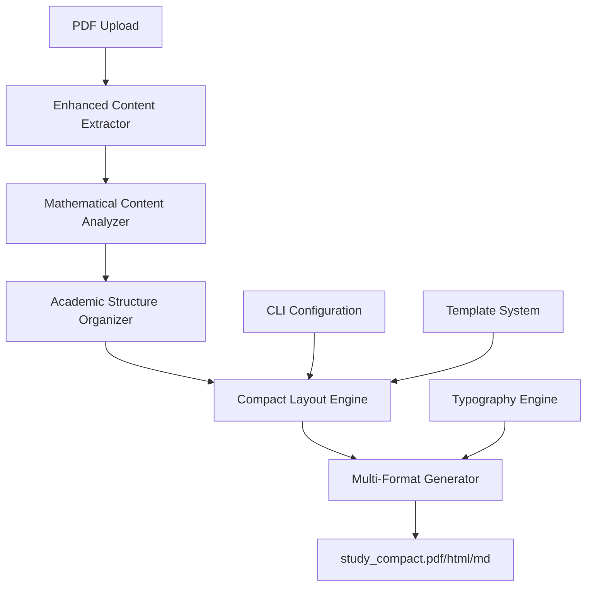

# Design Document

## Overview

The Compact Study Generator transforms the existing Study_1 generator from a card-based UI to a dense, academic-style study handout system. The architecture leverages existing file processing, AI content extraction, and PDF generation capabilities while introducing new compact layout engines, mathematical content preservation systems, and multi-format output generators.

The system processes discrete probability and relations PDFs, extracts all mathematical formulas and worked examples, then generates study_compact files in HTML, PDF, or Markdown formats with academic typography and two-column layouts optimized for print.

## Architecture

### High-Level System Flow



### Core Components

1. **Enhanced Content Extractor** - Extends existing file processing to identify and preserve mathematical formulas, worked examples, and academic structures
2. **Mathematical Content Analyzer** - Specialized processor for LaTeX/MathJax content extraction and preservation
3. **Academic Structure Organizer** - Creates the required Part I/Part II structure with numbered sections and cross-references
4. **Compact Layout Engine** - Generates dense, two-column layouts with academic typography
5. **Multi-Format Generator** - Outputs HTML, PDF, and Markdown with appropriate styling systems

## Components and Interfaces

### Enhanced Content Extractor

```typescript
interface MathematicalContent {
  formulas: Formula[];
  workedExamples: WorkedExample[];
  definitions: Definition[];
  theorems: Theorem[];
}

interface Formula {
  id: string;
  latex: string;
  context: string;
  type: 'inline' | 'display';
  sourceLocation: SourceLocation;
  isKeyFormula: boolean;
}

interface WorkedExample {
  id: string;
  title: string;
  problem: string;
  solution: SolutionStep[];
  sourceLocation: SourceLocation;
  subtopic: string;
}

interface SolutionStep {
  stepNumber: number;
  description: string;
  formula?: string;
  explanation: string;
}
```

### Academic Structure Organizer

```typescript
interface AcademicDocument {
  title: string;
  tableOfContents: TOCEntry[];
  parts: DocumentPart[];
  crossReferences: CrossReference[];
  appendices: Appendix[];
}

interface DocumentPart {
  partNumber: number;
  title: string;
  sections: AcademicSection[];
}

interface AcademicSection {
  sectionNumber: string; // e.g., "1.1", "2.3"
  title: string;
  content: string;
  formulas: Formula[];
  examples: WorkedExample[];
  subsections: AcademicSection[];
}

interface CrossReference {
  id: string;
  type: 'example' | 'formula' | 'section' | 'theorem';
  sourceId: string;
  targetId: string;
  displayText: string; // e.g., "see Ex. 3.2"
}
```

### Compact Layout Engine

```typescript
interface CompactLayoutConfig {
  paperSize: 'a4' | 'letter' | 'legal';
  columns: 1 | 2 | 3;
  typography: TypographyConfig;
  spacing: SpacingConfig;
  margins: MarginConfig;
  mathRendering: MathRenderingConfig;
}

interface TypographyConfig {
  fontSize: number; // 10-11pt default
  lineHeight: number; // 1.15-1.25
  fontFamily: {
    body: string;
    heading: string;
    math: string;
    code: string;
  };
}

interface SpacingConfig {
  paragraphSpacing: number; // ≤ 0.35em
  listSpacing: number; // ≤ 0.25em
  sectionSpacing: number;
  headingMargins: {
    top: number;
    bottom: number;
  };
}

interface MathRenderingConfig {
  displayEquations: {
    centered: boolean;
    numbered: boolean;
    fullWidth: boolean; // for column overflow
  };
  inlineEquations: {
    preserveInline: boolean;
    maxHeight: number;
  };
}
```

### Multi-Format Generator

```typescript
interface OutputGenerator {
  generateHTML(document: AcademicDocument, config: CompactLayoutConfig): HTMLOutput;
  generatePDF(document: AcademicDocument, config: CompactLayoutConfig): PDFOutput;
  generateMarkdown(document: AcademicDocument, config: CompactLayoutConfig): MarkdownOutput;
}

interface HTMLOutput {
  html: string;
  css: string;
  mathJaxConfig: MathJaxConfig;
  metadata: OutputMetadata;
}

interface PDFOutput {
  buffer: Buffer;
  pageCount: number;
  metadata: OutputMetadata;
  latexSource?: string;
}

interface MarkdownOutput {
  markdown: string;
  pandocTemplate: string;
  metadata: OutputMetadata;
}
```

## Data Models

### Content Processing Pipeline

```typescript
interface ProcessingPipeline {
  input: SourceDocument[];
  stages: ProcessingStage[];
  output: AcademicDocument;
  config: CompactLayoutConfig;
}

interface SourceDocument {
  file: File;
  type: 'probability' | 'relations';
  extractedContent: ExtractedContent;
  mathematicalContent: MathematicalContent;
}

interface ProcessingStage {
  name: string;
  processor: ContentProcessor;
  config: any;
  dependencies: string[];
}
```

### CLI Configuration System

```typescript
interface CLIConfig {
  layout: 'compact' | 'standard';
  columns: 1 | 2 | 3;
  equations: 'all' | 'key' | 'minimal';
  examples: 'full' | 'summary' | 'references';
  answers: 'inline' | 'appendix' | 'separate';
  fontSize: string; // '10pt', '11pt', etc.
  margins: 'narrow' | 'normal' | 'wide';
  outputFormat: 'html' | 'pdf' | 'markdown' | 'all';
}

interface ConfigValidator {
  validate(config: CLIConfig): ValidationResult;
  applyDefaults(config: Partial<CLIConfig>): CLIConfig;
}
```

## Error Handling

### Mathematical Content Errors

```typescript
class MathContentError extends Error {
  constructor(
    message: string,
    public formulaId?: string,
    public sourceLocation?: SourceLocation,
    public recoverable: boolean = true
  ) {
    super(message);
    this.name = 'MathContentError';
  }
}

class LayoutError extends Error {
  constructor(
    message: string,
    public section?: string,
    public contentType?: string,
    public suggestion?: string
  ) {
    super(message);
    this.name = 'LayoutError';
  }
}
```

### Error Recovery Strategies

1. **Formula Extraction Failures**: Fall back to OCR text extraction, preserve as code blocks
2. **Layout Overflow**: Automatically adjust spacing, suggest content reduction
3. **Cross-Reference Failures**: Generate warning, continue with plain text references
4. **Math Rendering Issues**: Provide LaTeX source as fallback, generate warning

## Testing Strategy

### Unit Testing

1. **Mathematical Content Extraction**
   - Formula detection accuracy
   - LaTeX conversion correctness
   - Worked example parsing completeness

2. **Layout Engine**
   - Two-column layout generation
   - Typography rule application
   - Space utilization calculations

3. **Output Generators**
   - HTML/CSS generation correctness
   - PDF layout fidelity
   - Markdown structure preservation

### Integration Testing

1. **End-to-End Pipeline**
   - PDF input → compact output workflow
   - CLI configuration application
   - Multi-format output consistency

2. **Content Preservation**
   - Formula preservation across formats
   - Example completeness verification
   - Cross-reference link integrity

### Acceptance Testing

1. **Layout Requirements**
   - No visual boxes/cards present
   - Two-column layout implementation
   - Compact typography application

2. **Content Requirements**
   - All source formulas preserved
   - Worked examples with complete steps
   - Proper academic structure organization

3. **Output Quality**
   - Print-ready PDF generation
   - Responsive HTML layout
   - Pandoc-compatible Markdown

### Performance Testing

1. **Processing Speed**
   - Large PDF processing time
   - Memory usage optimization
   - Concurrent processing capability

2. **Output Quality**
   - Page count reduction verification
   - Content density measurements
   - Mathematical rendering performance

## Implementation Phases

### Phase 1: Core Infrastructure
- Enhanced content extractor with math detection
- Academic structure organizer
- Basic compact layout engine

### Phase 2: Layout and Typography
- Two-column layout implementation
- Typography engine with compact rules
- Mathematical content rendering system

### Phase 3: Multi-Format Output
- HTML generator with compact CSS
- PDF generator with LaTeX backend
- Markdown generator with Pandoc templates

### Phase 4: CLI and Configuration
- Command-line interface implementation
- Configuration validation system
- Default compact layout profiles

### Phase 5: Quality and Testing
- Comprehensive test suite implementation
- Performance optimization
- Error handling and recovery systems