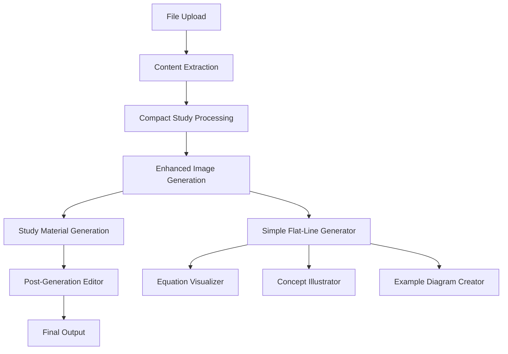

# Design Document

## Overview

This design outlines the removal of the normal cheat sheet generator functionality while preserving only the compact study generator, and enhancing the image generation system to create simple, flat-line visual representations. The system will be streamlined to focus on compact study materials with improved visual aids and post-generation editing capabilities.

## Architecture

### Current System Analysis

The current system has two main generation paths:
1. **Normal Cheat Sheet Generator** - Located in `.kiro/specs/cheat-sheet-generator/` with full workflow
2. **Compact Study Generator** - Located in `.kiro/specs/compact-study-generator/` with specialized processing

The image recreation system uses DALL-E 3 for generating complex, realistic images. We need to replace this with a simple flat-line image generator.

### Target Architecture



## Components and Interfaces

### 1. Removal Components

#### CheatSheetRemovalService
```typescript
interface CheatSheetRemovalService {
  removeCheatSheetComponents(): Promise<RemovalResult>
  updateImports(): Promise<void>
  cleanupRoutes(): Promise<void>
  updateTests(): Promise<void>
}

interface RemovalResult {
  removedFiles: string[]
  updatedFiles: string[]
  brokenReferences: string[]
  cleanupRequired: string[]
}
```

### 2. Enhanced Image Generation

#### SimpleImageGenerator
```typescript
interface SimpleImageGenerator {
  generateFlatLineImage(request: FlatLineImageRequest): Promise<GeneratedImage>
  createEquationVisualization(equation: string, context: string): Promise<GeneratedImage>
  createConceptDiagram(concept: ConceptData): Promise<GeneratedImage>
  createExampleIllustration(example: ExampleData): Promise<GeneratedImage>
}

interface FlatLineImageRequest {
  type: 'equation' | 'concept' | 'example' | 'diagram'
  content: string
  context: string
  style: FlatLineStyle
  dimensions: ImageDimensions
}

interface FlatLineStyle {
  lineWeight: 'thin' | 'medium' | 'thick'
  colorScheme: 'monochrome' | 'minimal-color'
  layout: 'horizontal' | 'vertical' | 'grid'
  annotations: boolean
}

interface ConceptData {
  title: string
  elements: ConceptElement[]
  relationships: Relationship[]
}

interface ExampleData {
  problem: string
  solution: string
  steps: string[]
  visualElements: VisualElement[]
}
```

### 3. Post-Generation Editor

#### StudyMaterialEditor
```typescript
interface StudyMaterialEditor {
  loadGeneratedMaterial(materialId: string): Promise<StudyMaterial>
  addContent(section: ContentSection): Promise<void>
  removeContent(sectionId: string): Promise<void>
  editContent(sectionId: string, newContent: string): Promise<void>
  addImage(imageRequest: FlatLineImageRequest): Promise<void>
  removeImage(imageId: string): Promise<void>
  regenerateImage(imageId: string, newRequest: FlatLineImageRequest): Promise<void>
  saveChanges(): Promise<void>
  exportMaterial(format: 'pdf' | 'html' | 'markdown'): Promise<string>
}

interface StudyMaterial {
  id: string
  title: string
  sections: ContentSection[]
  images: GeneratedImage[]
  metadata: MaterialMetadata
}

interface ContentSection {
  id: string
  type: 'text' | 'equation' | 'example' | 'list'
  content: string
  order: number
  editable: boolean
}
```

## Data Models

### Enhanced Image Generation Models

```typescript
interface FlatLineImageGenerator {
  // SVG-based generation for crisp, scalable images
  generateSVG(request: FlatLineImageRequest): Promise<SVGImage>
  
  // Canvas-based generation for complex layouts
  generateCanvas(request: FlatLineImageRequest): Promise<CanvasImage>
  
  // Text-to-diagram conversion
  parseTextToDiagram(text: string): DiagramElements
}

interface SVGImage {
  id: string
  svgContent: string
  base64: string
  dimensions: ImageDimensions
  metadata: ImageMetadata
}

interface DiagramElements {
  shapes: Shape[]
  text: TextElement[]
  connections: Connection[]
  annotations: Annotation[]
}

interface Shape {
  type: 'rectangle' | 'circle' | 'arrow' | 'line'
  position: Point
  size: Size
  style: ShapeStyle
}

interface TextElement {
  content: string
  position: Point
  style: TextStyle
  mathMode: boolean
}
```

### Post-Generation Editor Models

```typescript
interface EditableStudyMaterial {
  sections: EditableSection[]
  images: EditableImage[]
  layout: LayoutConfiguration
  history: EditHistory[]
}

interface EditableSection {
  id: string
  content: string
  type: SectionType
  position: number
  locked: boolean
  dependencies: string[]
}

interface EditableImage {
  id: string
  type: 'generated' | 'original'
  source: ImageSource
  editable: boolean
  regenerationOptions: RegenerationOptions
}

interface RegenerationOptions {
  availableStyles: FlatLineStyle[]
  contentHints: string[]
  contextOptions: string[]
}
```

## Error Handling

### Removal Process Error Handling

```typescript
interface RemovalErrorHandler {
  handleBrokenReference(file: string, reference: string): Promise<void>
  handleMissingDependency(dependency: string): Promise<void>
  rollbackChanges(checkpoint: string): Promise<void>
  validateRemoval(): Promise<ValidationResult>
}

interface ValidationResult {
  success: boolean
  errors: RemovalError[]
  warnings: RemovalWarning[]
  suggestions: string[]
}
```

### Image Generation Error Handling

```typescript
interface ImageGenerationErrorHandler {
  handleGenerationFailure(request: FlatLineImageRequest, error: Error): Promise<FallbackImage>
  handleInvalidContent(content: string): Promise<ContentSuggestion[]>
  handleStyleConflict(style: FlatLineStyle): Promise<FlatLineStyle>
}

interface FallbackImage {
  type: 'placeholder' | 'text-based' | 'simple-diagram'
  content: string
  message: string
}
```

## Testing Strategy

### 1. Removal Testing

```typescript
describe('CheatSheet Removal', () => {
  test('should remove all cheat sheet components')
  test('should update all import statements')
  test('should not break compact study functionality')
  test('should clean up all routes and API endpoints')
  test('should update test files')
})
```

### 2. Enhanced Image Generation Testing

```typescript
describe('Simple Image Generation', () => {
  test('should generate flat-line equation visualizations')
  test('should create concept diagrams')
  test('should handle invalid content gracefully')
  test('should maintain consistent styling')
  test('should generate appropriate fallbacks')
})
```

### 3. Post-Generation Editor Testing

```typescript
describe('Study Material Editor', () => {
  test('should load generated materials correctly')
  test('should add and remove content sections')
  test('should regenerate images with new parameters')
  test('should save and restore editor state')
  test('should export in multiple formats')
})
```

### 4. Integration Testing

```typescript
describe('Complete Workflow', () => {
  test('should process files through compact study generator only')
  test('should generate appropriate flat-line images')
  test('should allow post-generation editing')
  test('should maintain content fidelity throughout process')
})
```

## Implementation Phases

### Phase 1: Removal and Cleanup
- Remove cheat sheet generator components
- Update imports and dependencies
- Clean up routes and API endpoints
- Update tests and documentation

### Phase 2: Simple Image Generator
- Implement SVG-based flat-line image generation
- Create equation visualization system
- Build concept diagram generator
- Add example illustration capabilities

### Phase 3: Post-Generation Editor
- Build editor interface components
- Implement content modification system
- Add image regeneration capabilities
- Create export functionality

### Phase 4: Integration and Testing
- Integrate all components
- Comprehensive testing
- Performance optimization
- Documentation updates

## Technical Considerations

### Image Generation Technology Stack
- **SVG Generation**: For crisp, scalable mathematical diagrams
- **Canvas API**: For complex layouts and custom drawing
- **MathJax/KaTeX**: For mathematical notation rendering
- **D3.js**: For data visualization and diagram generation

### Editor Technology Stack
- **React**: For interactive editor components
- **Draft.js or Slate.js**: For rich text editing
- **Fabric.js**: For image manipulation and positioning
- **React DnD**: For drag-and-drop functionality

### Performance Considerations
- Lazy loading of editor components
- Efficient SVG generation and caching
- Optimized image storage and retrieval
- Real-time preview with debouncing