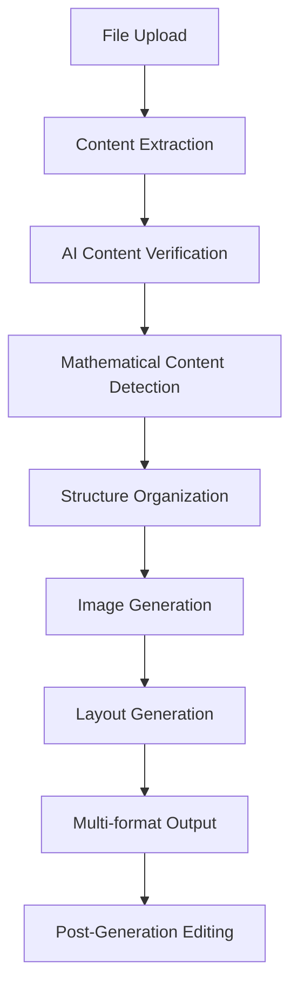

# CheeseSheet Technical Architecture & Logic

This document explains the technical architecture, logic, and techniques used in CheeseSheet - an AI-powered study guide generator.

## 🏗️ System Overview

CheeseSheet transforms academic documents (PDFs, Word docs, PowerPoint) into optimized, compact study guides with AI-enhanced content verification and educational image generation.

### Core Philosophy
- **Content Quality First**: AI-powered verification ensures educational value
- **Visual Learning**: Comprehensive image generation shows complete solution processes
- **Compact Design**: Dense, print-ready layouts maximize information density
- **Educational Focus**: Step-by-step explanations rather than just final answers

## 🎯 Application Logic Flow



### 1. **File Upload & Processing**
```typescript
// Multi-format file support with intelligent type detection
const supportedFormats = {
  'application/pdf': PDFProcessor,
  'application/vnd.openxmlformats-officedocument.wordprocessingml.document': WordProcessor,
  'text/plain': TextProcessor
}
```

### 2. **Content Extraction Pipeline**
- **PDF Processing**: Uses `pdf-parse` for text extraction with OCR fallback
- **Word Documents**: `mammoth.js` for structure-preserving conversion
- **Text Analysis**: Pattern recognition for mathematical content and examples

### 3. **AI Content Verification**
```typescript
// Intelligent content quality analysis
class AIContentQualityVerifier {
  async verifyAndImproveContent(content: string): Promise<VerifiedContent> {
    // Detect bullet point spam, redundancy, fragmentation
    // Preserve mathematical content and examples
    // Improve educational value while maintaining accuracy
  }
}
```

## 🧠 AI Integration & Techniques

### OpenAI Integration
- **GPT-4** for content analysis and improvement
- **GPT-3.5-turbo** for content verification and structure organization
- **Custom prompts** optimized for educational content

### Content Analysis Techniques

#### 1. **Mathematical Content Detection**
```typescript
// Pattern matching for mathematical elements
const mathPatterns = {
  latex: /\$([^$]+)\$|\\\(([^)]+)\\\)|\\\[([^\]]+)\\\]/g,
  equations: /[a-zA-Z]\s*=\s*[^,\s.]+/g,
  probability: /P\([^)]+\)\s*=\s*[^,\s.]+/g,
  summation: /∑|∏|∫/g
}
```

#### 2. **Educational Value Assessment**
```typescript
// AI-powered educational value scoring
const assessEducationalValue = async (content: string) => {
  const criteria = [
    'Clarity of explanations',
    'Presence of examples and applications', 
    'Logical structure and flow',
    'Depth of information',
    'Usefulness for learning'
  ]
  return aiScore; // 0-1 scale
}
```

#### 3. **Content Quality Verification**
- **Redundancy Detection**: Similarity analysis between sentences
- **Bullet Point Spam Filter**: Identifies and converts meaningless lists
- **Educational Content Preservation**: Protects formulas, examples, definitions
- **Coherence Analysis**: Ensures logical flow and structure

## 🎨 Image Generation System

### Simple Image Generator Architecture
```typescript
class SimpleImageGenerator {
  // Creates educational visualizations, not just decorative images
  async generateFlatLineImage(request: FlatLineImageRequest): Promise<GeneratedImage>
  
  // Specialized generators for different content types
  createEquationVisualization()    // Shows derivation steps
  createExampleIllustration()      // Step-by-step solutions
  createConceptDiagram()          // Relationship visualizations
}
```

### Educational Image Generation Logic

#### 1. **Equation Visualizations**
```typescript
// Comprehensive equation analysis and visualization
interface EquationVisualizationData {
  originalEquation: string
  equationType: 'quadratic' | 'linear' | 'trigonometric' | 'probability'
  variables: string[]           // Extracted and defined
  derivationSteps: string[]     // How to derive the equation
  applications: string[]        // When and how to use it
  explanation: string          // What the equation means
}
```

#### 2. **Example Illustrations**
```typescript
// Step-by-step solution visualization
interface ExampleData {
  problem: string              // Given problem statement
  givenInformation: string[]   // Extracted "given" data
  findRequirement: string      // What needs to be found
  solutionSteps: ExampleStep[] // Detailed solution process
  finalAnswer: string          // Clear final result
}

interface ExampleStep {
  description: string          // What this step does
  formula: string             // Formula used (if any)
  calculation: string         // Actual calculation
  result: string              // Step result
  explanation: string         // Why this step is needed
}
```

### Image Generation Techniques

#### 1. **SVG-Based Generation**
- **Scalable Vector Graphics** for crisp mathematical diagrams
- **MathJax integration** for proper mathematical notation
- **Responsive layouts** that work at any size

#### 2. **Educational Templates**
```typescript
const templates = {
  'mathematics_step-by-step': {
    layout: 'vertical',
    sections: ['problem', 'given', 'steps', 'answer'],
    annotations: ['variable', 'operation', 'result']
  },
  'physics_problem-solution': {
    layout: 'structured',
    sections: ['given', 'find', 'formula', 'calculation', 'result'],
    visualElements: ['diagram', 'vectors', 'forces']
  }
}
```

## 🏗️ Architecture Components

### Frontend Architecture (Next.js 15)

#### 1. **App Router Structure**
```
app/
├── page.tsx                 # Main CheeseSheet interface
├── api/                     # API routes
│   ├── generate-compact-study/  # Main generation endpoint
│   ├── health/              # Health check
│   └── monitoring/          # Performance monitoring
└── edit-study-material/     # Post-generation editor
```

#### 2. **Component Architecture**
```typescript
// Main generator component with state management
export function CompactStudyGenerator() {
  const [uploadedFiles, setUploadedFiles] = useState<File[]>([])
  const [config, setConfig] = useState<CompactStudyConfig>()
  const [results, setResults] = useState<CompactStudyResponse>()
  
  // Handles complete workflow from upload to output
}
```

### Backend Architecture (Node.js)

#### 1. **Modular Service Architecture**
```
backend/lib/
├── ai/                      # AI services
│   ├── content-quality-verifier.ts
│   ├── simple-image-generator.ts
│   └── image-generation-error-handler.ts
├── compact-study/           # Core study generation
│   ├── ai-enhanced-structure-organizer.ts
│   ├── html-output-generator.ts
│   ├── pdf-output-generator.ts
│   └── types.ts
├── file-processing/         # File handling
├── monitoring/              # Performance tracking
└── utils/                   # Shared utilities
```

#### 2. **Processing Pipeline**
```typescript
// Main processing orchestrator
class PipelineOrchestrator {
  async processStudyMaterials(files: File[], config: Config): Promise<StudyGuide> {
    // 1. Extract content from files
    const extractedContent = await this.extractContent(files)
    
    // 2. Verify and improve content quality
    const verifiedContent = await this.verifyContent(extractedContent)
    
    // 3. Organize structure with AI
    const organizedDocument = await this.organizeStructure(verifiedContent)
    
    // 4. Generate educational images
    const imagesGenerated = await this.generateImages(organizedDocument)
    
    // 5. Create final output formats
    return await this.generateOutputs(organizedDocument, config)
  }
}
```

## 🔧 Technical Techniques & Algorithms

### 1. **Content Analysis Algorithms**

#### Similarity Detection
```typescript
// Jaccard similarity for redundancy detection
function calculateSimilarity(text1: string, text2: string): number {
  const words1 = new Set(text1.toLowerCase().split(/\s+/))
  const words2 = new Set(text2.toLowerCase().split(/\s+/))
  
  const intersection = new Set([...words1].filter(x => words2.has(x)))
  const union = new Set([...words1, ...words2])
  
  return intersection.size / union.size
}
```

#### Mathematical Content Extraction
```typescript
// Multi-pattern mathematical content detection
class MathContentExtractor {
  extractFormulas(text: string): Formula[] {
    const patterns = [
      { type: 'latex', regex: /\$([^$]+)\$/g },
      { type: 'equation', regex: /([a-zA-Z]\s*=\s*[^,\s.]+)/g },
      { type: 'probability', regex: /P\([^)]+\)\s*=\s*[^,\s.]+/g }
    ]
    
    return patterns.flatMap(pattern => 
      this.extractWithPattern(text, pattern)
    )
  }
}
```

### 2. **AI-Enhanced Structure Organization**

#### Content Clustering
```typescript
// Semantic clustering of related content
class ContentClusterer {
  async clusterContent(sections: Section[]): Promise<ClusteredContent> {
    // Use AI embeddings to group related content
    const embeddings = await this.generateEmbeddings(sections)
    const clusters = this.performClustering(embeddings)
    return this.organizeClusters(clusters)
  }
}
```

#### Intelligent Section Creation
```typescript
// AI-powered section boundary detection
function detectSectionBoundaries(text: string): SectionBoundary[] {
  const indicators = [
    /^#{1,6}\s/,           // Markdown headers
    /^\d+\.\s/,            // Numbered sections
    /^[A-Z][^.!?]*$/,      // Title case lines
    /^(Definition|Theorem|Example|Proof):/i  // Academic keywords
  ]
  
  return this.findBoundariesWithAI(text, indicators)
}
```

### 3. **LaTeX PDF Generation**

#### Multi-Stage LaTeX Processing
```typescript
class PDFOutputGenerator {
  generateLaTeXSource(document: AcademicDocument): string {
    return `
      ${this.generateDocumentClass(config)}
      ${this.generatePackages()}
      ${this.generateGeometry(config)}
      ${this.generateMathSettings()}
      \\begin{document}
      ${this.generateContent(document)}
      \\end{document}
    `
  }
  
  // Handles list conversion to prevent "Lonely \item" errors
  convertListsToLaTeX(content: string): string {
    // Groups consecutive list items and wraps in proper environments
    return this.processListEnvironments(content)
  }
}
```

### 4. **Performance Optimization Techniques**

#### Memory Management
```typescript
// Intelligent memory management for large files
class MemoryManager {
  processLargeFile(file: File): Promise<ProcessedContent> {
    if (file.size > MEMORY_THRESHOLD) {
      return this.processInChunks(file)
    }
    return this.processDirectly(file)
  }
  
  processInChunks(file: File): Promise<ProcessedContent> {
    // Stream processing for large files
    const chunks = this.createChunks(file)
    return this.processChunksSequentially(chunks)
  }
}
```

#### Caching Strategy
```typescript
// Multi-level caching for performance
interface CacheStrategy {
  fileProcessing: LRUCache<string, ProcessedContent>
  imageGeneration: RedisCache<string, GeneratedImage>
  aiResponses: MemoryCache<string, AIResponse>
}
```

## 🔄 Data Flow & State Management

### 1. **File Processing Flow**
```
File Upload → Type Detection → Content Extraction → 
Text Cleaning → Mathematical Content Detection → 
AI Content Verification → Structure Organization → 
Image Generation → Layout Generation → Output Creation
```

### 2. **State Management**
```typescript
// React state management for complex workflows
interface AppState {
  uploadedFiles: File[]
  processingStage: ProcessingStage
  configuration: StudyGuideConfig
  generatedContent: StudyGuideContent
  generatedImages: GeneratedImage[]
  errors: ProcessingError[]
  warnings: string[]
}
```

### 3. **Error Handling & Recovery**
```typescript
// Comprehensive error handling with fallbacks
class ErrorHandler {
  async handleProcessingError(error: ProcessingError): Promise<RecoveryAction> {
    switch (error.type) {
      case 'latex_compilation':
        return this.fallbackToPuppeteerPDF()
      case 'ai_service_unavailable':
        return this.useRuleBasedProcessing()
      case 'memory_exhausted':
        return this.processInSmallerChunks()
      default:
        return this.gracefulDegradation()
    }
  }
}
```

## 🚀 Performance & Scalability

### 1. **Optimization Strategies**
- **Lazy Loading**: Components and images loaded on demand
- **Code Splitting**: Route-based and component-based splitting
- **Memory Management**: Intelligent garbage collection and chunk processing
- **Caching**: Multi-level caching strategy (memory, Redis, CDN)

### 2. **Scalability Considerations**
- **Horizontal Scaling**: Stateless design enables multiple instances
- **Load Balancing**: Nginx reverse proxy for traffic distribution
- **Database Scaling**: Redis for session storage and caching
- **CDN Integration**: Static asset optimization

### 3. **Monitoring & Analytics**
```typescript
// Comprehensive monitoring integration
interface MonitoringSystem {
  performance: SentryIntegration
  analytics: PostHogIntegration
  logging: StructuredLogging
  healthChecks: HealthCheckEndpoints
}
```

## 🔒 Security Architecture

### 1. **Input Validation**
```typescript
// Comprehensive input validation
const fileValidation = z.object({
  name: z.string().max(255),
  size: z.number().max(50 * 1024 * 1024), // 50MB limit
  type: z.enum(['application/pdf', 'text/plain', 'application/vnd.openxmlformats-officedocument.wordprocessingml.document'])
})
```

### 2. **Content Security**
- **File Type Validation**: Strict MIME type checking
- **Content Sanitization**: XSS prevention in generated HTML
- **LaTeX Security**: Sandboxed LaTeX execution
- **API Rate Limiting**: Prevents abuse of AI services

### 3. **Environment Security**
```typescript
// Secure environment variable management
const envSchema = z.object({
  OPENAI_API_KEY: z.string().min(1),
  NEXTAUTH_SECRET: z.string().min(32),
  NODE_ENV: z.enum(['development', 'production', 'test'])
})
```

## 📊 Quality Assurance

### 1. **Testing Strategy**
- **Unit Tests**: Individual component and function testing
- **Integration Tests**: API endpoint and service integration
- **E2E Tests**: Complete user workflow testing
- **Performance Tests**: Memory usage and processing time

### 2. **Code Quality**
```typescript
// TypeScript strict mode configuration
{
  "compilerOptions": {
    "strict": true,
    "noImplicitAny": true,
    "noImplicitReturns": true,
    "noUnusedLocals": true,
    "noUnusedParameters": true
  }
}
```

### 3. **Continuous Integration**
- **Automated Testing**: GitHub Actions for CI/CD
- **Code Coverage**: Minimum 85% coverage requirement
- **Security Scanning**: Dependency vulnerability checks
- **Performance Monitoring**: Automated performance regression detection

---

## 🎯 Key Innovations

### 1. **AI-Powered Content Verification**
Unlike traditional document processors, CheeseSheet uses AI to analyze and improve content quality, removing redundant bullet points and ensuring educational value.

### 2. **Educational Image Generation**
Instead of decorative images, CheeseSheet generates comprehensive visualizations showing complete solution processes, derivation steps, and educational context.

### 3. **Mathematical Content Preservation**
Advanced pattern recognition and AI analysis specifically designed to preserve and enhance mathematical content, formulas, and worked examples.

### 4. **Compact Academic Layout**
Specialized LaTeX generation optimized for dense, print-ready academic content with proper mathematical notation and professional formatting.

### 5. **Multi-Format Intelligence**
Intelligent processing pipeline that adapts to different document types while maintaining content fidelity and educational structure.

---

**CheeseSheet Technical Architecture v1.0**
*Comprehensive AI-powered study guide generation system*